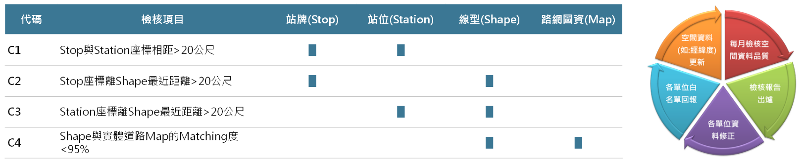
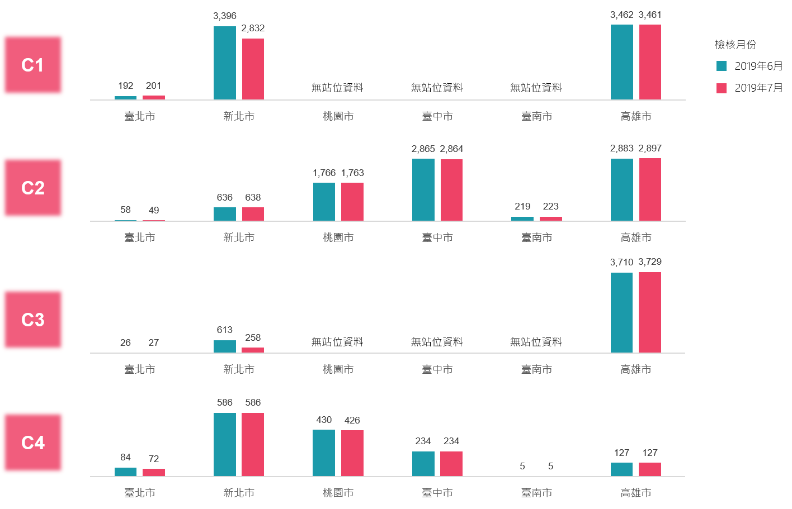

# 資料品質檢核

 **檢核 PTX 六都公車資料是否符合空間品質檢核標準**

檢核目的：為了強化空間資料品質內容，落實運輸資訊共用共享原則，今年度將進行資料品                          質檢核報告推動，透過交通部空間資料品質檢核工具，週期性通報各單位 資料品質檢核報告結果，並請來源端協同修正相關圖資，落實公共運輸資料服務供應的準確性。

檢核對象：六都之市區公車空間線型資料 

檢核頻率：每月一次

 **本月空間檢核成果（檢核時間：2019-07-01 12:00:00）**

